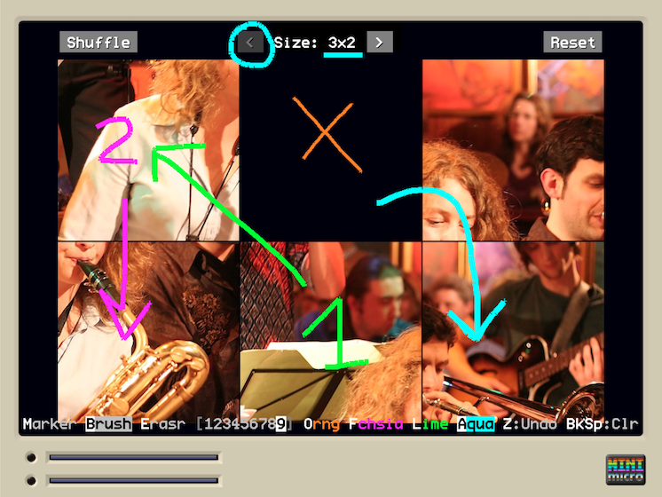

# Overlay Tool

Overlay drawing tool for the Mini Micro.



When invoked it starts a simple drawing program, which allows you to draw with the mouse over existing content.

This can be useful when streaming, making screenshots, explaining, brainstorming, etc.

It works on a "high" display in the display hierarchy (by default slot 1) so that all other content is "below" it.


## Installation

Place the `overlay.ms` file anywhere you want to import it as a module. Either next to your main program or anywhere in your modules path.

## Usage

* Draw / erase with the mouse
* To draw using the **marker**: press "m"
* To draw using the **brush**: press "b"
* To **erase**: press "e"
* To **quit**: press "q" or ESC
* To **undo**: press "z"
* Change **thickness**: press keys "1" to "9"
* Set **colors**: press first letter of "**o**range", "**f**uchsia", "**a**qua", "**l**ime" to set these colors
* Cycle **colors**: press "c"

## Modes of operation

This tool is typically used in any of these modes:

1. Stand-alone
1. Stand-alone (global)
2. Embedded "blocking" (from another program)
3. Embedded "non-blocking" (from another program)

### Stand-alone

In this mode you just load "overlay.ms" and run it.

Doing so starts the interactive-drawing mode on whatever is below display 1.

### Stand-alone (global)

In this mode you configure your "startup.ms" file so that the interactive-drawing mode can be invoked with a simple command, regardless of what program is currently loaded.

Like this:

```
import "overlay"
// Change "ov" to whatever suits you
ov = @overlay.draw

// Save this state to survive "reset"s
_saveGlobals
```

You can then invoke `ov` (or whatever you chose) from the console.

### Embedded "blocking"

In this mode you invoke the interactive-drawing from one of your programs / games. 

Doing so **blocks** any other activity in your main program. Once done the main program continues.

You do so by the following steps:

1. Import the module
2. Invoke the interactive-drawing whenever it suits you

Sample code:

```
import "overlay"

// ...
clear

// Your game main loop
while true

  // ... some logic ...
  
  if k == "o" then
    // Start interactive drawing.
    // This does not return until done (blocks).
    overlay.draw
  end if 

  yield
end while
```

Calling `draw` automatically sets-up the display, so there is no need to perform an extra setup step.

### Embedded "non-blocking"

In this mode you integrate the interactive-drawing into one of your programs / games, particularly into its main "loop".

This is useful if you want to draw while an animation or any other activity is happening in your program, as it does not block it.

However, you have to take care of initializing the display and carefully invoking the "update" function of the module.

Follow these steps:

1. Import the module
2. Initialize the module (*after* `clear`) with `setup`
3. Run an `udpate` operation for each main-loop cycle

> NOTE: initializing the module involves setting up the display for the tool. Do this AFTER any possible `clear` commands, as this command resets the displays.

Sample code:

```
import "overlay"

// ...
clear

// Initialize tool
overlay.setup

// Your game main loop
while true

  // ... some logic ...

  // Invoke an "update" operation on the tool
  overlay.update

  yield
end while
```

> NOTE: as the tool itself makes usage of key events and mouse clicks be sure that these do not interfere with your game / program. If they do, consider using the "blocking" mode instead.

## Configuration

You can change some aspects of the tool by setting some module variables.

These are:

* `CLEAR_AT_EXIT`: Whether to clean drawing when tool exits. Default is "true".
* `CLEAR_AT_STARTUP`: Whether to clean drawing when tool starts or is re-invoked. Default is "true".
* `DISPLAY_NR`: Which display slot to use for the tool Default is 1.
* `COLORS`: a list of the available colors. Default is: `[color.orange, color.lime, color.fuchsia, color.aqua]`
* `KEY_COLOR_MAP`: A map from keys to color-indexes (relative to the previous list). As stated elsewhere, by default the first letters of "orange", "fuchsia", "lime" and "aqua" map to their respective colors. There are also aliases for "blue" (letter b) to "aqua" and "green" (letter g) to "lime".

If you want to change any of these parameters you can do so either in the source-code itself or by changing a value _before_ either `setup` or `draw`.

Example:

```
import "overlay"

// Change configuration

overlay.DISPLAY_NR = 0
overlay.CLEAR_AT_EXIT = false

overlay.COLORS = [color.black, color.white]
overlay.KEY_COLOR_MAP = {"b": 0, "w": 1}

// Invoke tool

overlay.draw
```
